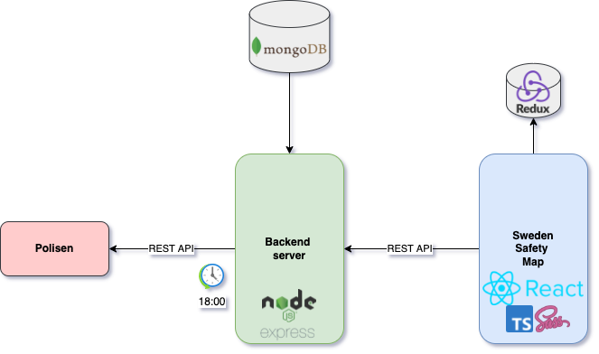

This project is built using Express Node JS. 



Sweden Safety Backend implements a scheduler whose daily task is to fetch incidents data from Polisen API. Polisen exposes data of all incidents that happened in Sweden. Since their response can include maximum 500 results, Sweden Safety Backend has to actively fetch data and store all new incidents that are not already stored in the database. The incidents, fetched from the Polisen API, are stored in MongoDB using Mongoose library.

Sweden Safety Backend exposes an API whose response includes a list of all criminal incidents and incident summaries per county. An example API response can be found below:
```json
{
  "incidents": [
    {
      "location": {
        "name": "Stockholm",
        "gps": "59.329324,18.068581"
      },
      "id": "61e5aebeae5a8f3c40104d63",
      "datetime": "2022-01-17 18:40:11 +01:00",
      "name": "17 januari 16:42, Rån, Stockholm",
      "summary": "En man stjäl en dator från en kvinna och misshandlar en annan kvinna.",
      "type": "Rån"
    }
  ],
  "citySummary": {
    "stockholm": {
      "topReportingCities": [
        {
          "city": "Stockholm",
          "numberOfIncidents": 69
        }
      ],
      "lastReported": [
        {
          "location": {
            "name": "Stockholm",
            "gps": "59.329324,18.068581"
          },
          "datetime": "2022-02-05 7:18:14 +01:00",
          "name": "05 februari 00:38, Stöld, Stockholm",
          "summary": "I Vasastaden ryckte en okänd gärningsman av brottsoffrets halskedja.",
          "type": "Stöld"
        }
      ],
      "safetyIndex": 7,
      "incidentSum": [
        {
          "incidentType": "Rån",
          "numberOfIncidents": 21
        }
      ],
      "incidentsPer": 12
    }
  }
}

```

Sweden Safety Backend filters out noncriminal incidents and provides only data about the following incident types: 
```javascript
const INCLUDED_TYPES = [
  "Misshandel",
  "Försvunnen person",
  "Mord/dråp, försök",
  "Olaga hot",
  "Bedrägeri",
  "Rattfylleri",
  "Inbrott",
  "Stöld",
  "Narkotikabrott",
  "Anträffad död",
  "Åldringsbrott",
  "Mord",
  "Skadegörelse",
  "Skottlossning",
  "Rån",
  "Våld",
  "Ofredande",
  "Vapenlagen",
  "Utlänningslagen",
];
```
Sweden Safety Backend groups all incidents per county in Sweden. It provides data for the following counties: 
Stockholm, Blekinge, Dalarna, Gävleborg, Halland, Jämtland, Jönköping, Kalmar, Kronoberg, Norrbotten, Skåne, Södermanland, Uppsala, Värmland, Västerbotten, Västernorrland, Västmanland, Västra Götaland, Örebro, Östergötland (see [cities.js](cities.js))


